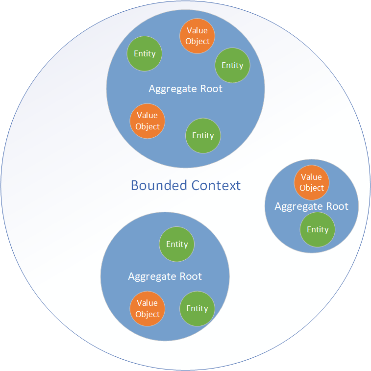
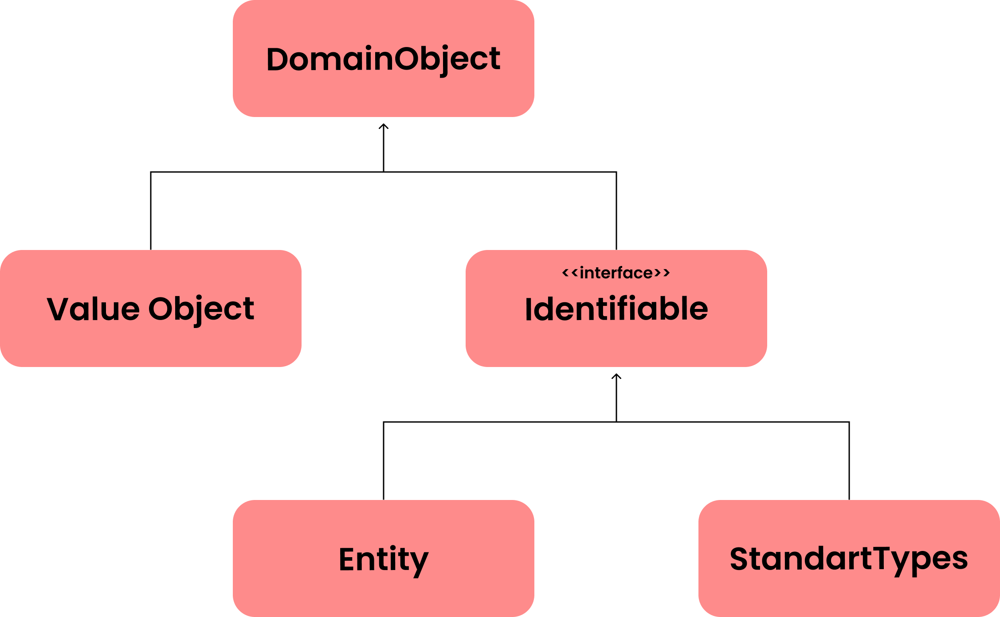
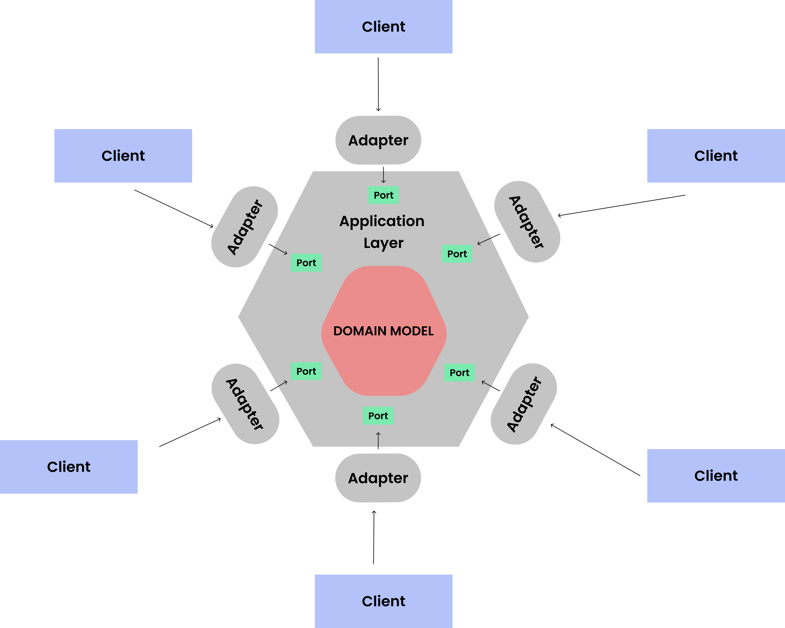

# Domain Driven Design ve Alakalı Tasarım Noktaları


- Domain-Driven-Design temel olarak bir projeyi alakalı olduğu alanın kurallarını izleyerek modüler bir şekilde tasarlamak amacıyla izlenen kurallar bütünüdür.

- İki alt başlıkta ele alınabilir; Strategic ve Tactical.


## Strategic Domain-Driven Design

- En başta, temel bir tanım yapılırsa, domain, belirli bir alandaki bilgi ve aktivite birikimidir. Domain bütünü, çeşitli alt elemanlardan oluşur ve bunlar üç sınıfta incelenir, core-domain, supporting sub-domain, generic sub-domain. Core domain, organizasyonun ve projenin asıl odak noktası olup, diğer organizasyonlardan fark yarattığı noktaları içerir. Supporting sub-domain, organizasyon için gerekli asıl amaç olmayıp amaca hizmet eden önemli bir araç konumundadır, proje sürecinde, gerekliliklere göre düzenlenip, amaca uygun olarak özelleştirilebilir. Generic sub-domain, herhangi bir özelleştirme gerektirmeyen, kullanıma hazır paketlerdir. Bu noktada, farklı projeler için, bir subdomain farklı şekilde ele alınabilir.

- Domain aynı zamanda "Problem Domain" olarak da referans edilebilir. Yazılım ürününün amacı da bu kısımda belirtilen problemlerin çözülmesi için geliştirilir. Vaugh Vernon bu ayrımı problem space ve solution space olarak yapmıştır.


### The Ubiquitous Language
	
- Ubiquitous language, temel olarak, proje içerisinde ortak bir akıl oluşturmak ve projenin bireylerinin iletişiminin kolay ve doğru olmasını sağlamak üzere oluşturulur. Bu proje bireyleri, geliştiriciler ve domain uzmanlarından 
oluşur. Farklı prensiplerden oluşan bir toplulukta, kolay iletişim için ortak dil çok önemli bir yere sahiptir. Projenin, domain mantığında, amacına uygun, doğru çalışabilmesi için domain uzmanlarının bu ortak dile ve sürece katkısı
olmazsa olmazdır.
- Domain özelindeki her bir terim ve isimlendirme, ortak dile dahil olur. Bu dil üzerinden projenin şekillenmesi ile domain model meydana gelir, bu da daha sonra koda dökülür. 
- Sürecin doğru seyrinde olup olmadığını
saptayabilmek için ortak dil önemli bir araçtır. Süreç bu ortak dil kullanılarak, sorunsuz bir şekilde aktarılabiliyorsa işler doğru ilerliyor demektir.


### Bounded Context

- Domain içerisinde büyük, tek bir model tanımlamak yerine, sınırları olan ve belirli alanlardan sorumlu bounded contextler kullanılır. Her bir context, ortak dil içerisinde kendine has bir isimle tanımlanır.

- Mikroservisler bounded context için iyi bir örnektir. Her biri kendi bağlamında çalışıp, belirli sorumluluklarını yerine getirir ve birbirleri ile iletişim halinde olurlar. Bu iletişim farklı yollar ile gerçekleştirilebilir. Upstream ve downstream kavramlarını bir nehir üzerinde iki yerleşim gibi düşündüğümüzde, nehrin üst tarafındaki upstream, aşağı tarafındaki downstream olur ve her türlü gerekli veya gereksiz hatta zararlı kaynak upstreamden 
downstreame nehir yolu ile gönderilir. Bu metafor üzerinden, farklı yöntemler sunulabilir.
    	
    * Customer-Supplier : Upstream supplier, downstream customer olarak düşünüldüğünde, customer, supplier bağlamının ihtiyaçlarını gözeterek, kaynak sağlar.
    	
    * Conformist : Upstream, herhangi bir sorumluluk içerisinde olmaz ve her koşulda downstream upstreamin ihtiyaçlarını gözetir.
    	
    * Anticorruption Layer : Her iki tarafta kendi ihtiyaçlarını gözetirken, aradaki bir katman, kaynak akışını yönetir.
    		
    Ayrıca, 
    	
    * Open Host Service : Bir sisteme erişim, açıkça tanımlanmış bir protokol kullanılarak açıkça tanımlanmış hizmetler tarafından sağlanır. Bu protokol doğrultusunda sistemle iletişim kurmak herkese açıktır.
    		
- Context iletişiminde, iletişim zaman geçtikçe önemini yitirip bir gereksizlik haline gelebilir. Bu şekildeki durumların izlenip gerektiği noktada iletişimi koparmaya yönelik aksiyonların alınması doğru olacaktır.


- Divide and conquer prensibi doğrultusunda çalışan stratejik tasarım, işleri hem planlama hem de geliştirme aşamasında daha kolay hale getirir. Her iki süreçte de daha yönetilebilir bir yapı ortaya çıkarmaya olanak sağlar.


## Tactical Domain-Driven Design

- Taktik tasarım daha pratik ve gerçek koda daha yakındır. Taktik tasarımın amacı, domain modelini çalışan bir koda dönüştürülebilecek bir aşamaya getirmektir. İlk olarak stratejik tasarım ile başlanır ve bunu taktik izler ve önemli
  farkındalıklar burada oluşurken, çoğu önemli karar da bu kısımda verilir. Bu kararlar stratejik tasarımı da etkiler vaziyette olduğu için iki süreç birbirini etkiler düzende tekrarlanır.


###  Value Objects

- Value object, taşıdığı değerler ile önemli olan bir nesnedir. Bu, tam olarak aynı değere sahip iki değer nesnesinin aynı değer nesnesi olarak kabul edilebileceği ve dolayısıyla birbirleri yerine kullanılabilir olduğu anlamına
  gelir.
- Value objectler her zaman immutable olmalıdır. Objenin durumunu değiştirmek yerine, onu yeni bir örnekle değiştirirsiniz. Immutable, iş operasyonlarını thread-safe hem de side-effect-free hale getirir. Value
  objectleri mümkün olduğunca küçük ve tutarlı hale getirmeye çalışılmalıdır, bu onların bakımını ve yeniden kullanımını kolaylaştırır.Value object kullanımı ayrıca esnek ve genişletilebilir bir geliştirme ortamı sağlar.

- Örneğin, parasal değerler için bir BigDecimal kullanmak yerine, bir BigDecimal'i saran bir Money value objecti kullanılabilir. Birden fazla para birimi ile uğraşıyorsanız, bir Currency value objecti de oluşturmak ve Money
  nesnenizi bir BigDecimal-Currency çifti sarmak isteyebilirsiniz.


- Value object kullanmanın çeşitli avantajları vardır. Öncelikle, semantic açıdan koda katkıda bulunurlar. Okunabilirlik açısından, örneğin bir string içinde ne depolandığını anlamaya çalışmaya gerek kalmadan, bir value object
  sayesinde, bu objenin özellikleri ve projedeki yerine göre bir anlam çıkarmamız daha sağlıklı olur. Bir diğer avantajı, bir mesele ile ilgili operasyonları barındırarak, "Separation of Concerns" prensibini destekler
  nitelikte bir yapı oluşturmaya yardım etmesidir. Konu ile ilgili özellik ve operasyonlar, bir value object içerisinde izole bir şekilde gerçekleştirilmiş olur. Son olarak, value object kendi içerisindeki özellik ve operasyonlarla
  doğrudan ilişkide olduğu için, bu elemanların doğrulanması konusunda daha güvenilir ve sağlıklı bir yapı sağlar.


```
public final class EmailAddress {
    private static final EmailValidator validator = EmailValidator.getInstance();
    private final String value;

    public EmailAddress(String value) {
        if (!validator.isValid(value)) {
            throw new InvalidEmailException();
        }
        this.value = value;
    }

    public EmailAddress change(String value) {
        return new EmailAddress(value);
    }

    @Override
    public String toString() {
        return value;
    }

    @Override
    public boolean equals(Object o) {
        if (o == null || getClass() != o.getClass()) return false;
        EmailAddress that = (EmailAddress) o;
        return Objects.equals(value, that.value);
    }

    @Override
    public int hashCode() {
        return Objects.hash(value);
    }
}
```


### Entities

- Entity, kimliği önemli olan bir nesnedir. Bir entitynin kimliğini belirleyebilmek için, her entitiynin, entity oluşturulduğunda atanan ve entitiynin ömrü boyunca değişmeden kalan benzersiz bir kimliği vardır. Aynı tipte iki
  entitiy , aynı ID sahibi ise, diğer tüm özellikleri farklı olsa bile, aynı entity olarak kabul edilir.

- Bir entity mutable bir biçimdedir ancak setter metotları uygun  bir şekilde dizayn edilip, karmaşıklık yaratmayacak şekilde gerçekleştirilmelidir. Örneğin, bir değişken değeri farklı sebeplerle değişebiliyor ve bu sebep iş
  mantığında kullanılmakta ise bu değişimi gerçekleştirmek için daha genel bir metot kullanımı daha doğru olacaktır. Bu tip düzenlemelere uygulamanın bağlamına(context) göre karar verilmelidir.


```
public class Person {

    private final PersonId personId;
    private final EventLog changeLog;

    private PersonName name;
    private LocalDate birthDate;
    private StreetAddress address;
    private EmailAddress email;
    private PhoneNumber phoneNumber;

    public Person(PersonId personId, PersonName name) {
        this.personId = Objects.requireNonNull(personId);
        this.changeLog = new EventLog();
        changeName(name, "initial name");
    }

    public void changeName(PersonName name, String reason) {
        Objects.requireNonNull(name);
        this.name = name;
        this.changeLog.register(new NameChangeEvent(name), reason);
    }

    public Stream<PersonName> getNameHistory() {
        return this.changeLog.eventsOfType(NameChangeEvent.class).map(NameChangeEvent::getNewName);
    }

    // Other getters omitted

    public boolean equals(Object o) {
        if (o == this) {
            return true;
        }
        if (o == null || o.getClass() != getClass()) {
            return false;
        }
        return personId.equals(((Person) o).personId);
    }

    public int hashCode() {
        return personId.hashCode();
    }
}

```
---
- Bir yapının entity mi value object mi olarak tasarlanacağı sorusunun cevabı bağlama göre değişiklik gösterebilse de, bir bağlamda value object olarak değerlendirilebilecek veri bir diğer bağlamda entity olarak ele alınabilir, verinin ne amaçla kullanılacağına göre bir karar vermek en doğrusu olur.
- İhtiyaç sadece veriyi depolamak ve sunmak ise value object bu noktada daha uygundur ancak veri spesifik noktalarda aynı türden verilerle farklılık gösteriyor ve bu farklılık ilişkide olduğu elemanları etkiliyorsa, entity kullanmak daha doğru olacaktır.
- Bunun haricinde daha geniş bir açıdan değerlendirilir ise daha sağlam ve modüler bir yapı sağlaması açısından value object kullanımı hedeflenip, entity sayısı olabildiğince az tutulmalıdır.


### Domain-Driven Design and CRUD 

CRUD işlemleri bir DDD için araç konumundadır, işin asıl mantığı değil mantığın işlenmesi için kullanılır durumdadır. CRUD tabanlı bir uygulamada mesele sadece veriyi kaydetme, düzenleme, görüntüleme ve silmeden meydana gelirken, DDD bu işlemleri kendi iş mantığı içerisinde kullanır. Bu bağlamda projenin her bir ucundaki tasarım bu anlayışa göre düzenlenmelidir.

- İş mantığındaki aksiyonların CRUD işlemlerini otomatikleştirerek, uygulamanın kullanılabilirliğini arttırdığı bir tasarım kullanılmalıdır. Örneğin, bir iş yerinde bir çalışan işten çıktığında, iş veren gerekli bilgileri girip "Kontratı Sonlandır" komutunu verdiğinde, bu komuta bağlı bütün aksiyonların sistem tarafından yapılması doğru bir yaklaşım olacaktır, öte yandan CRUD tabanlı bir yaklaşım olarak bütün aksiyonların bir iş mantığı olmaksızın, iş veren tarafından gerçekleştirilmesi kötü bir yaklaşım olur.


### Aggregates



Aggregate , belirli özelliklere sahip bir grup entity ve value object kümesidir.

- Aggregate bir bütün olarak oluşturulur, alınır ve saklanır.
- Aggregate her zaman tutarlı bir durumdadır.
- Aggregate , IDsi kümenin kendisini tanımlamak için kullanılan aggregate root adı verilen bir varlığa aittir. 

Aggregate konusunda dikkat edilmesi gereken iki husus vardır :

- Aggregate ile ilgili referanslar sadece Aggregate kökü üzerinden yapılabilir.
- Aggregate kökü, aggregate içerisindeki iş mantığı ile alakalı temel prensiplerin doğruluğundan sorumludur.
			
Burada bir başka konu ise bir tanımlanan entity, local mi yoksa root entity mi olacak sorusudur. Bu soru her kararda olduğu gibi domain ve bağlam değişkenlerine göre cevaplanır. Örneğin, 
		
- Entity uygulama içerisinde nasıl ulaşıma sahip?
		
    * Özel bir arama veya ID üzerinden ise kök olma şansı yüksektir.
					
- Karar verilmiş aggregate kökleri ile nasıl bir ilişkide?
			
  * Diğer kökler ile doğrudan bir ilişkide ise kök olma şansı yüksektir.
			
- Entity ile alakalı bir düzenleme durumunda herhangi bir bağımlılığa sahip mi?
			
  * Düzenleme durumunda bağımlılığı düşük ise kök olma şansı yüksektir.
					
Bir entity kök mü değil mi sorusuna cevap verdikten sonra, daha önce de bahsedildiği gibi, iş değişmezlerinin, entity hangi durumda olursa olsun sağlaması gereken standartlar, kontrolü yapılmalıdır. Bu konuda 
bu kontroller;
		
- Alakalı operasyonları direk olarak kökte gerçekleştirerek
- Local Entity içerisinde gerçekleştirip, kökte valide ederek
			
yapılabilir.

- Aggregate olabildiğince küçük tutulmalıdır. Okuma ve yazma işlerini daha küçük bir veri kümesi için yapmak, performansı arttıracaktır. Kökün iş değişmezlerinin kontrolünü gerçekleştirmesi de küçük çaplı kümeler için daha
  kolay bir hal alacaktır

- Aggregate kökleri arasındaki çağırma ve referansları ID üzerinden yapmak, herhangi bir yan etki oluşturmamak açısından önemlidir. Kökleri ID açısından kapsayan bir value object yardımı ile bu işlem gerçekleştirilebilir.

```
	
public class Invoice extends AggregateRoot<InvoiceId> {

  private CustomerId customerId;

  
  public void copyCustomerInformationToInvoice(CustomerRepository repository) {
      Customer customer = repository.findById(customerId);
      setCustomerName(customer.getName());
      setCustomerAddress(customer.getAddress());
      // etc.
      }
}
```

- Yukarıda Invoice ve Customer arasındaki referans, CustomerID value objesi ile Customer kümesinin kimliği sarmalanarak sağlanmıştır.

### UI Binding and Validation


- Kullanıcıdan alınan verinin aggregate içine kayıt edilmesi için bir kaç yol vardır. 
- İlki veri kaynağı ile küme arasında direk bir ilişki oluşturup, her bir property için oluşturulmuş setter metotları ile verinin kaydedilmesidir ancak
  bu yol veriye bağımlı olması ve bütün operasyonun dar bir katmanda yapılması açısından, pek iyi bir yaklaşım değildir.
- Bir diğer yaklaşım ise, veri aktarımı için de bir aggregate kullanılmasıdır. Örneğin bir üyelik için elimizde 	Membership aggregate kökü var ise, verinin buraya transferi için de MembershipApplication adında bir diğer aggregate kullanabiliriz. Veri MembershipApplication tarafından düzgün bir şekilde alınıp kontrolü yapıldıktan sonra Membership
  için girdi olarak kullanılabilir.
- Son olarak da, veriyi aktarmak için essence pattern isimli bir yaklaşımı kullanabiliriz. Bu yaklaşımda, aggregate için gerekli veriyi ilk olarak bir, input ile bağlı olan bir essence objesinde kayıt
  ederiz. Veri gerektiği gibi toplandığında gerçek entity oluşturmak için kullanılır. Bu yaklaşımın ikinci yaklaşımdan farkı, essence objesi modelde yer almaz, sadece bir araç olarak kullanılır. 

```
public class Person extends AggregateRoot<PersonId> {

    private final DateOfBirth dateOfBirth;
    // Rest of the fields omitted

    public Person(String firstName, String lastName, LocalDate dateOfBirth) {
        setDateOfBirth(dateOfBirth);
        // Populate the rest of the fields
    }

    public Person(Person.Essence essence) {
        setDateOfBirth(essence.getDateOfBirth());
        // Populate the rest of the fields
    }

    private void setDateOfBirth(LocalDate dateOfBirth) {
        this.dateOfBirth = Objects.requireNonNull(dateOfBirth, "dateOfBirth must not be null");        
    }

    @Data // Lombok annotation to automatically generate getters and setters
    public static class Essence {
        private String firstName;
        private String lastName;
        private LocalDate dateOfBirth;
        private String streetAddress;
        private String postalCode;
        private String city;
        private Country country;

        public Person createPerson() {
            validate();
            return new Person(this);
        }

        private void validate() {
            // Make sure all necessary information has been entered, throw an exception if not
        }
    }
}

```

### Domain Events

Domain event, modelde meydana gelen ve birden fazla bölümü ilgilendiren olaylara denir. Yeni bir entity oluşumu ve var olan üzerinde bir güncelleme olabilir. 
- Domain model içerisinde gerçekleşen event, event listener yardımı ile izlenir ve iş mantığı bu listener aracılığı ile tetiklenir.
- Projenin tasarımında bu event ve event listener konusunda titiz olunmalıdır, gereğinden fazla kullanmamak sağlıklı olur, aksi taktirde olası bir hatada debug etmek
zorlaşır. Aynı zamanda modelde meydana gelen eventlerin loglanması da süreç kontrolünde önemli bir yer tutar aksi taktirde model de meydana gelen yan etkilerden veya hatalı sonuçlardan haberdar olamayız.

Domain Eventlerin Dağıtımı

Vaugh Vernon, "Implementing Domain-Driven Design" kitabında eventlerin event listenerlara dağıtımı için iki yol sunar.

- Distribution Through a Message Queue : Bir publisher-subscriber sistemi üzerinden çalışan sistemde, eventi üreten bölüm, eventi bir mesaj sırasına(MQ) yollar ve bu sıraya erişimi olan event listenerlar eventleri buradan 
alırlar. 

- Distribution Through an Event Log : Bu yaklaşımda ise event listenerlar bir sıra yerine bir havuzdan eventleri alırlar. 


### Eventual Consistency	

Uygulama genelindeki veriler herhangi bir anda senkronize olmak zorunda değildir ancak en son durumda senkronize bir hale gelirler. DDD içerisinde, domain eventleri bu prensip ile çalışır. Örneğin publisher-subscriber sistemi
kullanılır ise publisherin veriyi sıraya atması ile event listenerin bu veriyi alması senkronize ilerlemez ancak, doğru kontroller doğrultusunda, sistem en son durumda tutarlı bir yapıya sahip olur. Bu tip bir yapıyı hazırlarken
sıradaki verinin işlenme mekanizması iyi ayarlanmalıdır aksi taktirde zaman aşımına uğramış veriler, zamanında gerçekleştirilemeyip performansı olumsuz yönde etkileyen operasyonlarla karşılaşılabilinir.

```
public class OrderShipped implements DomainEvent {
    private final OrderId order;
    private final Instant occurredOn;
		
    public OrderShipped(OrderId order, Instant occurredOn) {
        this.order = order;
        this.occurredOn = occurredOn;
    }


}
```
```
public class Order extends AggregateRoot<OrderId> {
    // Other methods omitted

    public void ship() {
        // Do some business logic
        registerEvent(new OrderShipped(this.getId(), Instant.now()));
    }
}
```
```
	 
public class InvoiceCreator {

    final OrderRepository orderRepository;
    final InvoiceRepository invoiceRepository;

    // Constructor omitted

    @DomainEventListener
    @Transactional
    public void onOrderShipped(OrderShipped event) {
        var order = orderRepository.find(event.getOrderId());
        var invoice = invoiceFactory.createInvoiceFor(order);
        invoiceRepository.save(invoice);
    }
}


```
---


- Bazı durumlarda, üzerinde çalıştığımız sınıflar doğal yollarla bir entity veya value object olarak sınıflandırılamazlar. Bu olay sınıfın doğası gereği her iki konsept içinde çelişkiler yaratması sonucu olabilir, örneğin ID
üzerinden tanımlanan bir sınıfın immutable olması gibi. Vaughn Vernon bu tip sınıfları "Standart Tipler" olarak adlandırmıştır. Bu gibi durumlarda, bu sınıfları, bir interface aracılığı ile genel hiyerarşiye katabiliriz. Bu tip
sınıfların izlemesi gereken iş kurallarını bi interface aracılığı ile tanımlayarak, aksi bir durum oluşturmaması kontrol edilebilir.




### Repositories

- Aggregatelerin saklandığı ve gerektiği zaman alındığı statik depolardır. Kaydetme, güncelleme ve silme gibi temel operasyonları gerçekleştirir. Genel olarak repository bir interface yapısında kurulur ve verinin asıl
  saklandığı yapı ile program arasında iletişimi sağlar. Repository, gerçek depolama alanını kapsayan nitelikte olsa da, depolama alanının yapısı repository tasarımını da etkiler ve temelde collection-oriented ve
  persistence-oriented olmak üzere iki kola ayrılır.

  * Collection-oriented, hafıza içi benzeri depolamayı sağlayarak add ve remove işlemleri üzerinden sürdürülür. Aggregate üzerinde yapılan değişiklikler otomatik olarak uygulanır.
  * Persistence-oriented, harici bir depo gibi davranarak insert, update ve delete işlemlerini gerçekleştirir. Yapılan değişiklikler update metotları kullanılarak net olarak depolama alanına kayıt edilmelidir.

Collection-oriented :
```
public interface OrderRepository {
  Optional<Order> get(OrderId id);
	
  boolean contains(OrderID id);
	
  void add(Order order);
	
  void remove(Order order);
	
  Page<Order> search(OrderSpecification specification, int offset, int size);
}
	
	
// Kullanım:
	
public void doSomethingWithOrder(OrderId id) {
    orderRepository.get(id).ifPresent(order -> order.doSomething());
    // Changes will be automatically persisted.
}

```

And then the persistence oriented repository:
```
public interface OrderRepository {

    Optional<Order> findById(OrderId id);
    
    boolean exists(OrderId id);
    
    Order save(Order order);
    
    void delete(Order order);
    
    Page<Order> findAll(OrderSpecification specification, int offset, int size);
}


// Kullanım:

public void doSomethingWithOrder(OrderId id) {
  orderRepository.findById(id).ifPresent(order -> {
    order.doSomething();
    orderRepository.save(order);
  });
}
```

- Yazım açısından çok fark oluşturmasalar da depolama alanının semantiğini uygulama açısından farklılıkları vardır.

---

- Uygulamanın veri tabanı ile iletişimini de CQRS temelinde gerçekleştirebiliriz.
- CQRS nedir dersek, basitçe okuma ve yazma işlemlerini birbirinden tamamen ayırmaktır, daha da geliştirip farklı veri tabanları ve mikro servisler 			özelinde de geliştirilebilir, aradaki bağımlılığı en aza indirmeyi amaçlayan bir tasarımdır. Örneğin, bir aggregate içerisindeki verinin küçük bir bölümüne ihtiyaç olduğunda, senkronizasyon ve performans açısından sorun oluşabilir.
  Bu sebeple iki işlemin kendi mantıkları çerçevesinde ele alınması, daha sağlıklı bir sistem oluşturmaya yardımcı olacaktır.

- CQRS tabanlı bir geliştirmede şu adımlar izlenebilir :

  * Kullanıcı komutları normal bir şekilde repository üzerinden işlemleri gerçekleştirebilir.
   	 	
  * Sorgular, repository üzerinden değil de, direk olarak veri tabanı ile iletişime geçerek gerçekleştirilebilir ve sadece gerekli verinin alınması sağlanır.
   	 	
  * Sorgularda, daha sonra aggregate verisinin tamamına ihtiyaç duyulması durumuna karşı veya verinin güncellenme isteğinde doğrudan ulaşılabilir olması için, ID içeren bir DTO(Data Transfer Objects) dönüşü yapılır.

### Domain Services
- Bazı senaryolarda, iş mantıklarını bir entity veya value object içerisine katmak mümkün olmayabilir. Bu gibi durumlarda  domain service adı verilen yapılar kullanılır.
- Domain Service, stateless olup, cohesive bir yapıda bir işe odaklı bir şekilde çalışırlar. Sistemin çalışması için gerekli işlemleri diğer bölümlerle iletişime geçerek sürdürürler.

```

public class TaskManager : DomainService, ITaskManager
{
    public const int MaxActiveTaskCountForAPerson = 3;

    private readonly ITaskRepository _taskRepository;

    public TaskManager(ITaskRepository taskRepository)
    {
        _taskRepository = taskRepository;
    }

    public void AssignTaskToPerson(Task task, Person person)
    {
        if (task.AssignedPersonId == person.Id)
        {
            return;
        }

        if (task.State != TaskState.Active)
        {
            throw new ApplicationException("Can not assign a task to a person when task is not active!");
        }

        if (HasPersonMaximumAssignedTask(person))
        {
            throw new UserFriendlyException(L("MaxPersonTaskLimitMessage", person.Name));
        }

        task.AssignedPersonId = person.Id;
    }

    private bool HasPersonMaximumAssignedTask(Person person)
    {
      var assignedTaskCount = _taskRepository.Count(t => t.State==TaskState.Active && t.AssignedPersonId == person.Id);
      return assignedTaskCount >= MaxActiveTaskCountForAPerson;
    }
}

```

- Burada kişilere atanan görevleri yöneten bir domain service, kişiler veya görevler özeline inmeden, iş mantığı çerçevesindeki kontrolleri gerçekleştirerek, sistemin çalışmasını sağlar. 


### Factories


Genelde aggregate oluşturmak için aggregate kökünün constructor metodu yeterlidir. Ancak bazı durumlarda Factory denen yapılara ihtiyaç duyulabilir. Bunlar :

- İş mantığı aggregate oluşumunu içeriyor ise
- Oluşum için kullanılan data değişkenlik gösterebiliyor ise
- Kullanılan veri çok büyük ise
   		
kısacası oluşum için bir tür manipülasyon gerektiğinde, Factory yapısı kullanmak akılcı olacaktır.


```
public class ShipmentRecipientFactory {
	private final PostOfficeRepository postOfficeRepository;
	private final StreetAddressRepository streetAddressRepository; 
	// Initializing constructor omitted
	ShipmentRecipient createShipmentRecipient(Customer customer) {
	    var postOffice = postOfficeRepository.findByPostalCode(customer.postalCode());
	    var streetAddress = streetAddressRepository.findByPostOfficeAndName(postOffice, customer.streetAddress());
	    var recipient = new ShipmentRecipient(customer.fullName(), streetAddress);
	    recipient.associateWithCustomer(customer.id());
	    return recipient;
	}
}

```

- Burada bir ShipmentRecipient objesi oluşturmak için kullanılan bir factory görüyoruz. Kullanılan data bir Customer objesi üzerinden alınıyor yani bir bağlamdan bir diğer bağlama dönüşüm söz konusu, haliyle çeşitli işlemlerin
  gerçekleştirilmesi gerekiyor. Bu işlemleri de createShipmentRecipient metodunda izole ederek daha modüler bir yapı elde ediyoruz.


---

## Domain-Driven Design and the Hexagonal Architecture

- Bu kısımda DDD prensiplerinin Hexagonal mimari ile nasıl kullanılabileceğine değineceğiz.

- Bu isimlendirme daha çok bir altıgen şeklinde tasvir edildiği ve resmedildiği için kullanılmaktadır.



- Aynı zamanda çalışma mantığına göre ports and adapters ve mimarisine göre katmanlı yapısı sebebiyle "Onion Architecture" olarak da adlandırılır.


### Hexagonal vs. Traditional Layers


- Aslen hexagonal mimariyi, geleneksel katmanlı mimarinin evrimleşmiş bir hali olarak düşünsek de, dış dünyayla iletişim kurma şekli açısından farkları vardır. Temelde ikisinde de UI, Application, Doman ve Infrastructure katmanları bulunsa da, daha önce belirttiğim gibi dış dünya ile iletişime sahip UI ve Application katmanlarında farklılıklar vardır. 
	 	
- En iç katmanda daha önceden bahsedilen, içerisinde iş mantığını barındıran domain model bulunur. Bu katman olabildiğince stabil tutulmaya çalışılır. 

### Application Katmanları

- Bir sonraki katmanda bulunan servis elemanları, içerisinde iş mantığı barındırmadan, mantığa göre sistemin düzgün çalışmasını sağlar. Bu servis elemanları herhangi bir durum özelliğine(state) sahip olmayan araçlardır. Herhangi bir karar mekanizması bulundurmadan sistem içerideki akışın güvenilir ve doğru olmasını sağlarlar.

```

public class MyBusinessProcess {
      // Current process state
  }
  
  public interface MyApplicationService {
  
      MyBusinessProcess performSomeStuff(MyBusinessProcess input);
  
      MyBusinessProcess performSomeMoreStuff(MyBusinessProcess input);
  }
  
```

- Varolan bir süreç üzerinden, gerekli fonksiyonları, doğru sırada kullanarak süreci yönetirler.

- Authentication ve Authorization işlemleri application katmanında gerçekleştirilir. Bu kapsamdaki işlemlerin domain model kısmına bırakılmaması gerekir aksi taktirde iş mantığı kompleks bir hale gelip, asıl amacından
sapabilir hatta işlevselliğini yitirebilir.

- Application katmanında bulunan, servis metotları, tek bir transaction gerçekleştirecek şekilde tasarlanmalıdır. Çünkü birden çok transaction ile herhangi birinde meydana gelebilecek hata, alınmaması gereken işlemlerin
  geri alınmasını tetikleyebilir.


### Orchestration


- Bu konsept, daha önce bir kaç kez değindiğim gibi, application katmanında, domain model içerisindeki aggregate kökleri aracılığı ile metotlara doğru şekilde ulaşıp, doğru girdi ve çıktılarla iş mantığını yürütme işidir ve 
belki de en çok zorlanılan kısım olabilir çünkü farkında olmadan bir iş mantığını burada uygulamak çok olasıdır. Ayrım yapmak kimi zaman zor olup gözden kaçabilir. Her zaman da keskin çizgilerle ayrım yapmaya da gerek yoktur. 			Bu ayrımı sağlamak her ne kadar iyi olsa da, bu amaca ulaşmak için gereğinden fazla zaman harcamak süreci daha sıkıntılı bir duruma sokabilir.

```
@Service
class CustomerRegistrationService {

    @Transactional 
    @PermitAll /
    public Customer registerNewCustomer(CustomerRegistrationRequest request) {
        var violations = validator.validate(request); 
        if (violations.size() > 0) {
            throw new InvalidCustomerRegistrationRequest(violations);
        }
        customerDuplicateLocator.checkForDuplicates(request);
        var customer = customerFactory.createNewCustomer(request); 
        return customerRepository.save(customer); 
    }
}
```
---
- Bu noktada Domain Event Listenerların projedeki konumundan da bahsedersek, uygulamamızdaki iş mantığı domain model içerisinde kurgulandığı ve bu mantık içerisinde meydana gelen olaylar sonucunda çeşitli
  aksiyonlar, application katmanında, gerçekleştirildiği için, bu aksiyonları dinleyip uygun yerlere ulaştırmakla yükümlü EventListenerlar da application katmanında bulunmalıdır.

### Girdi ve Çıktılar

- Application servislerinin girdi ve çıktılarını düzenlerken bir kaç faklı yol izleyebiliriz. İlki direk olarak entity ve value object kullanımı, ikincisi Veri Aktarım Objesi(DTO) kullanımı ve son olarak da bu ikisinin
  kombinasyonu niteliğindeki Etki Alanı Yükü Nesneleri(DPO) kullanımı.

- Direk olarak aggregate transferi küçük, yapıda, çok fazla iş mantığı barındırmayan ve içerisinde çok fazla değişim yaşamayan yapılar kullanışlı olabilir. Halihazırda kullandığınız yapılar üzerinden işlem sürdürüldüğü, başka
  bir yapıya veya bir yapıdan dönüşüm gerektirmediği için fayda sağlayabilir. Öte yandan client ile doğrudan bir ilişkide olunduğu için coupling artmış olur.

- DTO kullanımı, bir önceki yolun eksiklerini gidermek için kullanılır. Büyük, complex ve dinamik yapılarda kullanımı akıllıca olur. Bağlılığı azaltması ile daha esnek bir yapı sunsa da ek bir yapı oluşturma açısından iş yükü 
manasına gelir. Yarattığı modüler yapı sayesinde genellikle uğraşa değer bir yapıdır.
  	 
- DPO ise iki yöntemin kombinasyonu olarak içerisinde talep edilen domain modellerini barındırıp, bunları bir yapı içerisinde toplayarak isteklere cevap verir. DTO kadar özgün yapılar olmaması yönünden çok fazla iş yükü 
çıkarmasa da neticede ayrık bir yapıdır. Direk olarak domain modelleri kullanılması da bağımlılık ve yan etkiler açısından negatif etki yaratabilir.

```
public class CustomerListEntryDTO { //
    private CustomerId id;
    private String name;
    private LocalDate lastInvoiceDate;

    // Getters and setters omitted
}
```
```
@Service
public class CustomerListingService {

    @Transactional 
    public List<CustomerListEntryDTO> getCustomerList() {
        var customers = customerRepository.findAll(); // <2>
        var dtos = new ArrayList<CustomerListEntryDTO>();
        for (var customer : customers) {
            var lastInvoiceDate = invoiceService.findLastInvoiceDate(customer.getId()); // <3>
            dto = new CustomerListEntryDTO(); // <4>
            dto.setId(customer.getId());
            dto.setName(customer.getName());
            dto.setLastInvoiceDate(lastInvoiceDate);
            dtos.add(dto);
        }
        return dto;
    }
}
```
---
```


public class CustomerInvoiceMonthlySummaryDPO { // <1>
    private Customer customer;
    private YearMonth month;
    private Collection<Invoice> invoices;
	
    // Getters and setters omitted
}
```
```		
@Service
public class CustomerInvoiceSummaryService {

    public CustomerInvoiceMontlySummaryDPO getMonthlySummary(CustomerId customerId, YearMonth month) {
        var customer = customerRepository.findById(customerId); // <2>
        var invoices = invoiceRepository.findByYearMonth(customerId, month); // <3>
        var dpo = new CustomerInvoiceMonthlySummaryDPO(); // <4>
        dpo.setCustomer(customer);
        dpo.setMonth(month);
        dpo.setInvoices(invoices);
        return dpo;
    }
}
```

### Validation

- Bir sistemin hatalı bir duruma düşmemesi için giren ve çıkan verinin doğruluğunu kontrol etmek çok önemlidir. Giren veri kısmındaki kontroller UI kısmında kontrol edilebilse de bu yeterli değildir. Endpointler 		
  üzerinden işlem yapan bir sisteme, veri bir çok yolla gelebileceği için kontrolün sistem tarafından yapılması daha uygun olacaktır.

- Sistem üzerindeki validation, kaynağı dış dünya olması dolayısıyla daha çok girdi odaklıdır. Girdilerin kontrolü de iki format ve içerik olmak üzere sınıfta ele alınır. Format için örneğin bir şifrenin yeterli 
uzunlukta olmaması, içerik için de verilen bir kullanıcı isminin halihazırda kullanılıyor olması olabilir.
   		
- Validation için gerekli kontroller, domain modeldeki constructor veya setter metotları içerisinde yapılabileceği gibi, anotasyonlar kullanılarak da yapılabilir.

```		
public class PhoneNumber implements ValueObject {
    private final String phoneNumber;
    public PhoneNumber(String phoneNumber) {
    Objects.requireNonNull(phoneNumber, "phoneNumber must not be null"); 
    var sb = new StringBuilder();
    char ch;
    for (int i = 0; i < phoneNumber.length(); ++i) {
        ch = phoneNumber.charAt(i);
        if (Character.isDigit(ch)) { 
            sb.append(ch);
        } else if (!Character.isWhitespace(ch) && ch != '(' && ch != ')' && ch != '-' && ch != '.') { 
            throw new IllegalArgument(phoneNumber + " is not valid");
        }
    }
    if (sb.length() == 0) { 
        throw new IllegalArgumentException("phoneNumber must not be empty");
    }
    this.phoneNumber = sb.toString();
}
@Override
public String toString() {
    return phoneNumber;
}
	
	    // Equals and hashCode omitted
}

```
```		
public class Customer implements Entity {
				
// Fields omitted
public Customer(CustomerNo customerNo, String name, PostalAddress address) {
    setCustomerNo(customerNo); 
    setName(name);
    setPostalAddress(address);
}
public setCustomerNo(CustomerNo customerNo) {
    this.customerNo = Objects.requireNonNull(customerNo, "customerNo must not be null");
}
public setName(String name) {
    Objects.requireNonNull(nanme, "name must not be null");
    if (name.length() < 1 || name.length > 50) { 
        throw new IllegalArgumentException("Name must be between 1 and 50 characters");
    }
    this.name = name;
}
public setAddress(PostalAddress address) {
    this.address = Objects.requireNonNull(address, "address must not be null");
}
}

```
```		
public class Customer implements Entity {

	@NotNull 
	private CustomerNo customerNo;
				
	@NotBlank 
	@Size(max = 50)
	private String name;
				
	@NotNull
	private PostalAddress address;
				
	// Setters omitted
}
```

### Ports - Adapters

- Şu ana kadar tanımladığımız domain model ve bunun içerisindeki iş mantığını organize eden application katmanı, dış dünyadan gelen veri olmadan, bir anlam ifade etmez. Burada da devreye, bu bölümlerin, dış dünya
  ile iletişim kurması için, portlar ve adaptörler devreye girer.

#### Ports

- Sistemin dış dünya ile iletişim kurmasını, belirlenen tasarım doğrultusunda kontrol etmeye yarar ve sistem içerisine tutarsız bir verinin girmesini engeller. Bu ara yüz teknolojiden bağımsızdır ve her dış
  eleman için aynı şekilde hareket eder.

#### Adapters

- Her sistem dış dünyasıyla iletişim kurmak için ara yüzler. Bu ara yüzlerin birbirleri ile düzgün bir şekilde çalışabilmesi için, adaptörler, ikisi arasındaki iletişimi sağlar.

- Örneğin, Spring Data kullanırken application katmanında repository sınıfları tanımlarız. Bunlar bizim veri tabanımızla iletişimi sağlayan portlarımızdır. Repository de veri tabanı ile iletişimi sağlamak için
JPA kullanır ki burada adaptör rolündedir. JPA sayesinde istediğimiz veri tabanı ile(PostgreSQL, MySQL vs) farklı bir implementasyon olmadan iletişim kurabilmiş oluruz.

- Multi-Context bir uygulamamız olduğunda da haberleşmek için bu sistemleri kullanırız. Farklı sistemler üzerinde çalışan ve bir ağ üzerinden iletişim kuran bağlamlarımız var ise gönderici ve alıcı sistemler için sırasıyla controller ve client adaptörlerini kullanarak iletişim kurabiliriz. Tek bir
sistemdeki iki modül arasında bir iletişim olduğunda bağlamlar arasında eşlemeler yapıp iletişim sağlayan bir adaptör kullanabiliriz.

## Using Value Objects with JPA

- Bu bölümde value object ile veri tabanı arasındaki ilişkiyi inceleyeceğiz. Value object, basit şekilde sınıflandırılmak istenirse basit ve kompleks olarak ikiye ayrılabilir. Basit bir value object, integer, String gibi bir değer depolarken, kompleks bir value object birden çok değerde birden çok tip depolayabilir.

###  Attribute Converters

-Basit Value object ve veri tabanı arasında veri eşleşmesi gerçekleştirmek için AttributeConverter denen yapılar kullanılır. AttributeConverter bir sınıf özelliği ile bir veri tabanı kolonu arasında dönüşüm yapma yetisine sahiptir.


```
public class EmailAddress implements ValueObject { 

  private final String email; 
          
  public EmailAddress(@NotNull String email) { 
      this.email = validate(email); 
  }
          
  @Override
  public @NotNull String toString() { 
      return email;
  }
          
  @Override
  public boolean equals(Object o) { 
      if (this == o) return true;
      if (o == null || getClass() != o.getClass()) return false;
      EmailAddress that = (EmailAddress) o;
      return email.equals(that.email);
  }
          
  @Override
  public int hashCode() {
      return email.hashCode();
  }
          
  public static @NotNull String validate(@NotNull String email) {
      if (!isValid(email)) {
          throw new IllegalArgumentException("Invalid email: " + email);
      }
      return email;
  }
          
  public static boolean isValid(@NotNull String email) { 
      // Validate the input string
  }
          
}
```
```
@Converter 
public class EmailAddressAttributeConverter implements AttributeConverter<String, EmailAddress> { 

    @Override
    @Contract("null -> null")
    public String convertToDatabaseColumn(EmailAddress attribute) {
        return attribute == null ? null : attribute.toString(); 
    }

    @Override
    @Contract("null -> null")
    public EmailAddress convertToEntityAttribute(String dbData) {
        return dbData == null ? null : new EmailAddress(dbData); 
    }
}
```
```
@Entity
public class Contact {

    @Convert(converter = EmailAddressAttributeConverter.class)  // <1>
    private EmailAddress emailAddress;

    // ...
}

```
- Tek bir değer içeren, EmailAddress sınıfı bir dönüştürücü ile veri tabanına aktarılabilir.

### Embeddables

- Kompleks bir value object, @Embeddable anotasyonu kullanılarak başka bir entitiy içerisine gömülerek kullanılabilir. Bu tip value objectler için, JPA bazı taleplerde bulunur. İlki, value object içerisinde final bir özellik 
bulunmamasıdır.	Bir diğer talep ise bir no-argument constructor oluşturulmasıdır. Bu talepler doğrultusunda yapımızın hala immutable bir halde olmasını sağlamaya dikkat etmeliyiz. 


```
@Embeddable
public class PersonName implements ValueObject { 
			
	private String firstname; 
	private String middlename;
	private String lastname;
			
	@SuppressWarnings("unused")
	PersonName() {     
	}
			
	public PersonName(@NotNull String firstname, @NotNull String middlename, @NotNull String lastname){
	    this.firstname = Objects.requireNonNull(firstname);
	    this.middlename = Objects.requireNonNull(middlename);
	    this.lastname = Objects.requireNonNull(lastname);
	}
			
	public PersonName(@NotNull String firstname, @NotNull String lastname) { 
	    this(firstname, "", lastname);
	}
			
	public @NotNull String getFirstname() { // <6>
	    return firstname;
	}
			
	public @NotNull String getMiddlename() {
	    return middlename;
	}
			
	public @NotNull String getLastname() {
	    return lastname;
	}
			
	@Override
	public boolean equals(Object o) { // <7>
	    if (this == o) return true;
	    if (o == null || getClass() != o.getClass()) return false;
	    PersonName that = (PersonName) o;
	    return firstname.equals(that.firstname)
	        && middlename.equals(that.middlename)
	        && lastname.equals(that.lastname);
	}
			
	@Override
	public int hashCode() { // <8>
	    return Objects.hash(firstname, middlename, lastname);
	}
}

```
- Burada sınıfın immutable olmasını sağlamak amacıyla, setter metotları dışarıda bırakılmıştır ve no-args-constructor ise dışarıdan bir kullanım olmaması açısından herhangi bir erişim türü olmadan tanımlanmıştır.
```
@Entity
public class Contact {

    @Embedded
    private PersonName name;

    // ...
}

```
- PersonName sınıfı kullanıldığı entity içerisine gömülerek, fieldlar direk olarak entity içerisinde gibi değerlendirilir.

- Bu tip embedded sınıflarda, gömüldüğü sınıflar ile özellik isimlerinde çakışmalar olduğu zaman @AttributeOverride anotasyonu kullanılabilir.

```
@Embeddable
public class Address {
    private String name;
    private String city;

    // standard getters and setters
}  
```
```
@Embeddable
public class Brand {
    private String name;
    private LocalDate foundationDate;
    @Embedded
    private Address address;

    // standard getters and setters
}

```
```				
@Entity
@AttributeOverride(name = "identifier", column = @Column(name = "VIN"))
public class Car extends Vehicle {
    // existing fields

    @Embedded
    @AttributeOverrides({
      @AttributeOverride(name = "name", column = @Column(name = "BRAND_NAME", length = 5)),
      @AttributeOverride(name = "address.name", column = @Column(name = "ADDRESS_NAME"))
    })
    private Brand brand;

    // standard getters and setters
}

```

## Building Aggregates with Spring Data

Bu kısımda value objectleri içerecek olan entitylerin nasıl tasarlanacağına değineceğiz. Bunun için Spring Data bize yardım eden bir araçtır. Bize kullanıma hazır temel sınıflar sağlar.

- Persistable :  Entity için basit bir ara yüzdür. getID ve isNew metotlarını içererek kontrollü veri akışını sağlamaya çalışır. Ancak implement edilmesi zorunlu değildir. Spring Data ayın kontrolü optimistic locking kullanarak kendi
içerisinde sağlayabilmektedir.

- AbstractPersistable : Persistable sınıfını implement ederek daha gel bir mantık ile kontrol sağlar. Sadece ID üzerinden işlem gerçekleştirir ve ID bulunduran entity kalıcı, bulundurmayan yeni entity olarak sınıflandırılır.

- AbstractAggregateRoot : Tahmin edilebileceği üzere Aggregate kökleri tarafından extend edilmek üzere tasarlanmıştır. İçerdiği metotlar sayesinde aggregate kökünün domain eventlerini yönetmesini sağlar.

```
@MappedSuperclass
public abstract class BaseEntity<Id extends Serializable> extends AbstractPersistable<Id> { 

    @Version 
    private Long version;

    public @NotNull Optional<Long> getVersion() {
        return Optional.ofNullable(version);
    }

    protected void setVersion(@Nullable Long version) { 
        this.version = version;
    }
}
```

- @Version anotasyonu ile optimistic locking kullanımı görülmektedir. Bu version numarasına göre çakışma yaratabilecek işlemlerin kontrolü sağlanabiliyor.

```
@MappedSuperclass 
public abstract class BaseAggregateRoot<Id extends Serializable> extends BaseEntity<Id> {

    private final @Transient List<Object> domainEvents = new ArrayList<>();

    protected void registerEvent(@NotNull Object event) { 
        domainEvents.add(Objects.requireNonNull(event));
    }

    @AfterDomainEventPublication
    protected void clearDomainEvents() {
        this.domainEvents.clear();
    }

    @DomainEvents
    protected Collection<Object> domainEvents() {
        return Collections.unmodifiableList(domainEvents);
    }
}


```

- Burada BaseEntity sınıfının bir @Version etiketine sahip olması önemlidir. Örneğin; 

```
@Entity
public class Invoice extends BaseAggregateRoot<InvoiceId> { 

    @OneToMany(cascade = CascadeType.ALL, orphanRemoval = true)
    private Set<InvoiceItem> items; 

    // The rest of the methods and fields are omitted
}


```

-Burada @Version etiketinin neden kök için tasarlanan sınıfa değil de Entity sınıfına eklendiği sorgulanabilir.

- Yukarıdaki kod parçacığında version etiketi olmayan bir InvoiceItem objesinde değişiklik yapıp, Invoice aggregate kökünü veri tabanına kayıt ettiğinde, kök için tutulan version numarasını güncellemeyecektir böylece değişiklik 
overwrite edilebilir bir hale gelecektir. Local bir entity için version etiketi bulundurmak, içeride yapılan değişikliklerin veri tabanına düzgün bir şekilde aktarılabilmesi açısından önemlidir.  

## Building Repositories with Spring Data

- Aggregate tasarımından sonra bunların depolanması ve sorgulanması için kullanılacak repository tasarımından bahsedebiliriz. Spring Data ile basitçe bir repository ara yüzü oluşturup JPARepository extend ederek
  gerçekleştirebiliriz. Daha genel bir implementasyon için temel bir sınıf oluşturmak da faydalı olacaktır.

```
@NoRepositoryBean
public interface BaseRepository<Aggregate extends BaseAggregateRoot<ID>, ID extends Serializable> 
	        extends JpaRepository<Aggregate, ID>,  
	                JpaSpecificationExecutor<Aggregate> { 
	
	    default @NotNull Aggregate getById(@NotNull ID id) { 
	        return findById(id).orElseThrow(() -> new EmptyResultDataAccessException(1));
	    }
	}

public interface CustomerRepository extends BaseRepository<Customer, CustomerId> {
    // additional methods if needed
}

```

- Bir veri tabanından sorgu yaparken en basit yöntem Spring Data içerisindeki findBb… metotlarıdır. Basit yapıdaki sorgular için kullanışlı olsa da, kompleks sorgularda işleri zorlaştırabilir. Bu gibi durumlarda specification
  kullanmak işleri kolaylaştırabilir. Spring Data built-in olarak destek sağlamaktadır.

```
public class CustomerSpecifications {

    public @NotNull Specification<Customer> byName(@NotNull String name) {
        return (root, query, criteriaBuilder) -> criteriaBuilder.like( // <1>
            root.get(Customer_.name), // <2>
            name
        );
    }
		
    public @NotNull Specification<Customer> byLastInvoiceDateAfter(@NotNull LocalDate date) {
        return (root, query, criteriaBuilder) -> criteriaBuilder.greaterThan(root.get(Customer_.lastInvoiceDate), date);
    }
		
    public @NotNull Specification<Customer> byLastInvoiceDateBefore(@NotNull LocalDate date) {
        return (root, query, criteriaBuilder) -> criteriaBuilder.lessThan(root.get(Customer_.lastInvoiceDate), date);
    }
		
    public @NotNull Specification<Customer> activeOnly() {
        return (root, query, criteriaBuilder) -> criteriaBuilder.isTrue(root.get(Customer_.active));
    }
}

```
- Kullanımı ise ;

```
public class CustomerService {

    private final CustomerRepository repository;
    private final CustomerSpecifications specifications;

    public CustomerService(CustomerRepository repository, CustomerSpecifications specifications) {
        this.repository = repository;
        this.specifications = specifications;
    }

    public Page<Customer> findActiveCustomersByName(String name, Pageable pageable) {
        return repository.findAll(
            specifications.byName(name).and(specifications.activeOnly()),
            pageable
        );
    }
}

```

## Publishing Domain Events with Spring Data 

- Daha önce Domain eventlerin publish edilmesini BaseAggregateRoot sınıfında görmüştük. Arka planda Spring save ve saveAndFlush fonksifonlarının tamamını önleyici bir metot koşturur, ve @DomainEvents ve @AfterDomainEventPublication
  anotasyonlarına göre işlemler gerçekleştirir.

- DomainEvents anotasyonundan sonra, önleyici metot, Spring Application Event publisher kullanarak belirtilen eventleri publish eder. İşlem tamamlandıktan sonra @AfterDomainEventPublication altındaki metot çalıştırılır ve bu metottan 
publish edilen eventleri temizlemesi beklenir ki, tekrar publish edilmesi gibi bir durum olmasın.

- İçerisinde kendi aggregate köküne referans veren domain eventleri implement ederken dikkat edilmesi gereken bir konu vardır, detached edilmiş bir entity ile bir domain event kullanılırsa, detached edilmiş
  entity üzerinde işlem yapıldığı zaman, bu entity ilk olarak veri tabanından alınır, detached entity özellikleri kopyalanarak veri tabanına aktarılır ve version arttırılır. Ancak bizim referans olarak verdiğimiz detached entity içerisinde bu version arttırılmamış biçimde kalır. Bu da detached entity içerisinde değişiklik yapıp kaydetmek istediğimizde sıkıntıya yol açar. Bu sebeple kendi köküne referans veren eventlerde, kökün direk olarak değil, ID aracılığı ile, veri tabanından elde edilmesi daha doğru olacaktır.

```
public class SaferDomainEvent { 
    private final MyAggregate myAggregate;

    public SaferDomainEvent(@NotNull MyAggregate myAggregate) { // <1>
        this.myAggregate = myAggregate;
    }

    public @NotNull MyAggregateId getMyAggregateId() { // <2>
        return myAggregate.getIdentifier();
    }
}

```

## Handling Domain Events with Spring

- Spring Data, eventleri  standart olarak ApplicationEventPublisher kullanarak gönderir. Dinleme tarafında ise @EventListener anotasyonu kullanarak dinleyicileri belirtiriz.

```
@Component
class MyDomainEventHandler {

    @EventListener
    public void onMyDomainEvent(MyDomainEvent event) {
        // Handler code here.
    }
}

```

- Bir event publish edildikten sonra, ApplicationEventMulticaster yardımıyla dinleyicilere dağıtılır. Bir eventin publish edilmesi ile uygun dinleyicinin çağırılması aynı thread içerisinde gerçekleşir yani aynı transaction içerisinde
  gerçekleşir ki bir transaction içerisinde birden fazla aggregate ile çalışmak istenen bir şey değildir ancak yapılan işin farkında olunduğu sürece sorun teşkil etmez.

- Ancak publish ve listen arasındaki işlemler karmaşıklaşıp başka bölümler işin içine girdiğinde, optimistic locking ile alakalı sorunlar hatta deadlock sorunları ile karşılaşabiliriz. Ayrıca sorunlar handle edilebilir olsa bile bir
 transaction içerisinde olduğumuz için, bu sorun her koşulda rollback ile sonuçlanacak ve fazla sayıda işlemi geçersiz kılacaktır.
- Bu tip sıkıntılardan kaçınmak için @TransactionalEventListener kullanabiliriz. Anotasyon kullanımı aynı olsa da, bununla kullanılan dinleyiciler, halihazırda bi transaction devam ediyor ise direk olarak çalışmazlar, belirlenen 	zamanda(AFTER_COMMIT,BEFORE_COMMIT, AFTER_ROLLBACK and AFTER_COMPLETION) çalışmalarına başlarlar. Bu sayede birbirlerine olan etkileri azaltılmış olur.

## Eventual Consistency Through Scheduled Jobs

- Sistem içerisindeki operasyonları aynı zamanda Joblar üzerinden de gerçekleştirebiliriz. Bu joblar belirli zamanlar için ayarlanabildiği gibi, bir kullanıcı veya bir domain event tarafından da tetiklenebilirler. Bu noktada dikkat
  edilmesi gereken nokta tetikleyici ile job, direk olarak bağlı olmamalıdır, ikisi arasına bağlantıyı yönetici yapılar koymak akılcı olacaktır.

```
@DomainEventHandler
public class InvoiceGenerationOnShipmentTrigger {

    private final InvoiceCreationJob job;

    InvoiceGenerationOnShipmentTrigger(
            InvoiceCreationJob job) {
        this.job = job;
    }

    @TransactionalEventListener
    public void onInvoiceShipped(InvoiceShippedEvent evt) {
        job.createInvoiceForOrders(evt.getOrderId());
    }
}

```
```
@Component
public class InvoiceGenerationWorker {

    private final InvoiceCreationJob job;

    InvoiceGenerationWorker(InvoiceCreationJob job) {
        this.job = job;
    }

    @Scheduled(cron = "0 0 0 1/1 * ? *")
    public void atMidnight() {
        job.createInvoiceForAllOrders();
    }
}

```


```
@Service
	public class InvoiceGenerationService {
	
	    private final InvoiceCreationJob job;
	
	    InvoiceGenerationService(InvoiceCreationJob job) {
	        this.job = job;
	    }
	
	    @Secured("ROLE_ADMIN")
	    @Async
	    public void createInvoiceForAllOrders() {
	        job.createInvoiceForAllOrders();
	    }
	}

```
- Bir çalışmasının belirli bir düzende olup, durumlarının iyi belirlenmesi gerekmektedir. Bir iş bir koşula göre çalışıp, sistemi istenen duruma getirip, işlemi noktalamalıdır. Bir job birden fazla noktadan çalıştırılabileceği için bu
  durumda göz önüne alınıp, aynı anda tetiklenme durumunda yapılacak aksiyon belirlenmelidir. Halihazırdaki işin bitmesini bekleme, bitirip yerini alma veya iptal etme gibi.

```
@Component
public class InvoiceCreationJob {

    private final AtomicBoolean working 
        = new AtomicBoolean(false);

    @Transactional(propagation = REQUIRES_NEW)    
    public void createInvoiceForAllOrders() {
        if (working.compareAndSet(false, true)) {
            try {
                // Do the work
            } finally {
                working.set(false);
            }
        }
    }
}

```

- İşlerin koşturulduğu threadler de dikkat edilmesi gereken bir konudur. İşin, tetikleyici yapı ile aynı thread içerisinde mi, kendine ait bir thread içerisinde mi çalışacağı senaryo özelinde kara verilecek bir konudur. Örneğin, UI 	tabanlı bir işlem gerçekleşmekte ve bu işlem bir jobu tetikliyor ise bu durumda aynı thread içerisinde çalıştırmak, UI tarafının çalışmasını durduracaktır bu da kullanıcı tecrübesi açısından negatif bir yöndür. Bu tip bir işlemi farklı
  bir thread içerisinde yapmak daha doğru olacaktır. Bir başka durumda ise, bir job 5 dakika gecikme ile sürekli çalışıyor olsun. Eğer job farklı bir thread içerisinde çalışırsa, gecikme süresi çağrının yapıldığı threade göre çağırılma anından
  itibaren sayılacağı için, farklı thread içerisindeki job gecikme süresi olan 5 dakikayı aşarsa iki job aynı anda çalışır olacaktır, bu da istenmeyen durumlara yol açabilir.


- İşlerin süreleri ve ne zaman çalıştırılacağı konusu, domain özelinde karar verilmesi gereken bir konudur. Bağlam içerisindeki aktörlerin isteklerine göre, deneme yanılmalar sonucu bir denge sağlanmalıdır.

- Joblar ve zamana göre çalışmalarını sağlayan workerların, mimaride nerede bulundukları konusuna gelirsek, workerlar temel yapısı itibari ile bir iş mantığı barındırmadan, jobların çalışma sırasını düzenledikleri için, application katmanında bulunabilirler. Jobların kendisi ise, bağlam yapımıza göre değişiklik gösterir. Tek bağlamlı bir sistemimiz varsa, joblar domain service şeklinde gerçekleştirilebilirler. Çok bağlamlı bir sistemimiz var ise, entegrasyonumuza 	göre değişim gösterebilir. Bağlamlarn application katmanında bulunup, diğer bağlamlarla doğrudan veya ara yüzler aracılığı ile iletişimde olabileceği gibi, iki bağlam arasında kurulan "middleware" katmanında da, worker ve event handlerlarla birlikte, yer alabilirler.

- Entegre edilmesi ve kullanması kolay olsa da bağlamalar içine ekstra bir yapı eklenmesi açısından bağımlılığı arttırır yapıdadır.
